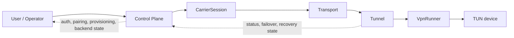

# Architecture

This document describes the product layers from the user-facing control plane down to the kernel TUN device. It focuses on the runtime path used by `vpn up`, `vpn exit-node`, mesh mode, and the packet-tunnel backend scaffold.

## End-To-End Data Flow



The important rule is that each layer owns one boundary:

- The control plane decides who is allowed to connect and which backend should run.
- The carrier session keeps the live media session open.
- The transport carries opaque byte frames inside that carrier.
- The tunnel owns packet framing, ARQ, and hot-swap preservation.
- The runner connects the tunnel to the kernel TUN device.

## Layer Map

### Control Plane

Source files:

- `src/baleobala/control/service.py`
- `src/baleobala/control/provisioning.py`
- `src/baleobala/control/backend.py`
- `src/baleobala/control/tunnel_service.py`

Responsibilities:

- Store auth, pairing, relay enrollment, and device authorization state.
- Issue and rotate credential epochs.
- Select the active backend for the current profile.
- Expose the narrow IPC surface used by the packet-tunnel scaffold.

Key interfaces:

- `VpnBackend` in `src/baleobala/control/backend.py`
- `TunnelService` in `src/baleobala/control/tunnel_service.py`
- `TunnelBridge` in `src/baleobala/control/tunnel_service.py`

### Carrier Layer

Source files:

- `src/baleobala/carrier/interfaces.py`
- `src/baleobala/carrier/livekit.py`
- `src/baleobala/bale/livekit_backend.py`

Responsibilities:

- Own the live media session.
- Provide audio and source/sink access for the carrier path.
- Publish or receive tunnel bytes through the carrier session.

Key interface:

- `CarrierSession` in `src/baleobala/carrier/interfaces.py`

### Transport Layer

Source files:

- `src/baleobala/vpn/transports/__init__.py`
- `src/baleobala/vpn/transports/datachannel_transport.py`
- `src/baleobala/vpn/transports/audio_transport.py`
- `src/baleobala/vpn/transports/video_qr_transport.py`
- `src/baleobala/vpn/transports/rpc_transport.py`
- `src/baleobala/vpn/crypto.py`

Responsibilities:

- Present a simple byte-channel abstraction to the tunnel.
- Hide carrier-specific mechanics behind a common `Transport` protocol.
- Support transport selection, transport chaining, and optional AEAD wrapping.

Key interface:

- `Transport` in `src/baleobala/vpn/transports/__init__.py`

### Tunnel Layer

Source files:

- `src/baleobala/vpn/tunnel.py`
- `src/baleobala/vpn/runner.py`
- `src/baleobala/vpn/router.py`
- `src/baleobala/vpn/supervisor.py`

Responsibilities:

- Fragment and reassemble packets.
- Provide selective-repeat ARQ.
- Keep the tunnel session alive across bearer swaps.
- Observe health and initiate failover when the current bearer stalls.

Key runtime objects:

- `Tunnel`
- `VpnRunner`
- `TransportPool`
- `FailoverController`
- `HealthMonitor`

### Kernel Boundary

Source files:

- `src/baleobala/vpn/tun.py`
- platform-specific backend glue under `src/baleobala/control/`

Responsibilities:

- Read IP packets from the kernel.
- Write decrypted or reassembled packets back to the kernel.
- Keep the user-space tunnel isolated from platform details.

## Interface Contracts

| Interface | Source | Contract |
| --- | --- | --- |
| `Transport` | `src/baleobala/vpn/transports/__init__.py` | Opaque byte frames with `send_bytes`, `recv_bytes`, and `close`. |
| `CarrierSession` | `src/baleobala/carrier/interfaces.py` | Live carrier session with audio sink/source access and start/stop lifecycle. |
| `VpnBackend` | `src/baleobala/control/backend.py` | Platform backend with `up`, `down`, `status`, and `probe`. |
| `TunnelBridge` | `src/baleobala/control/tunnel_service.py` | Minimal bridge used by the packet-tunnel scaffold to exchange bytes with the carrier/runtime. |
| `TunnelService` | `src/baleobala/control/tunnel_service.py` | IPC-facing service that owns lifecycle and state for the future native extension. |

## Data Boundaries

### User And Control Plane

The user-facing commands and GUI drive the control plane first. That layer decides:

- whether auth is present,
- whether the relay/device is approved,
- which backend should be used,
- and whether the current credential epoch is still valid.

### Control Plane And Carrier

The control plane creates or resumes a carrier session and ties the session to a profile or pairing record. The carrier itself does not decide VPN policy; it only provides the live session that can move bytes.

### Carrier And Transport

The carrier session exposes the media-side mechanisms used by the transport. A `Transport` implementation can be backed by LiveKit DataChannel, audio, QR, RPC, or another future carrier-specific path.

### Transport And Tunnel

The tunnel only sees opaque byte frames. It does not know whether the bytes came from DataChannel, audio, QR, or RPC. This keeps the tunnel logic stable while the bearer changes.

### Tunnel And TUN

The tunnel consumes IP packets from the kernel TUN device and writes reassembled packets back to it. This is the only place where kernel packet handling appears in the main user-space runtime.

## Topology (post-v0.4: no coordinator)

The system is two tiers: clients and relays. There is no rendezvous service. Each client app keeps a user-managed list of relay Bale `peer_id`s; to connect it picks one, places a Bale call to it, and runs the PSK handshake. If that fails it falls back to the next peer_id in the list.

```text
Client (app holds list of relay peer_ids)
   │
   │ pick → Bale StartCall → LiveKit DataChannel
   │ PSK handshake → BBMESH1 ack → tunnel up
   ▼
Relay (mesh exit-node) — one per Bale JWT, all on one VPS
   • accepts any inbound call (PSK authenticates)
   • resolves caller user_id from LiveKit participant identity
   • allocates a /30 from the pool, issues client via MeshExitNode
   • MASQUERADEs egress to eth0
```

### Relay (`src/baleobala/vpn/relay_handler.py`)

Each relay JWT maps to one `RelayCallHandler` instance shared across all account-indexed listen callbacks. The handler is a state machine with a correlation ID (`cid`, 8-char hex UUID prefix) threaded through every log call for tracing.

**Per-call lifecycle:**

1. Inbound Bale call arrives. If the per-account active flag is set (a previous session in flight) the new call is refused with `slot_busy` — the client will fall back to the next peer_id in its list.
2. Join phase: opens a LiveKit session (publish_audio=False) and waits for the caller to join the room.
3. Identity resolution: reads the caller's real user_id from `LiveKitSession.remote_participant_identities()`. `event.peer_id` from Bale is the relay's own user_id under push semantics, so this step is mandatory — without it every caller on the same relay account would collide on `mesh.issue_client`.
4. Tunnel phase: issues a mesh assignment (`MeshExitNode.issue_client()`), enables audio on the session (so the SFU keeps it alive past ~20 s), starts the `EncryptedTransport` with the global PSK, sends provisioning ACK.
5. Session reaper (`SessionReaper`) runs one teardown per cycle to avoid FFI contention in the livekit-rtc Rust runtime.

### Metrics and observability

- Relay: `http://127.0.0.1:9201/metrics` and `/healthz`
- Prometheus counters: `baleobala_relay_calls_total{outcome}` (committed, slot_busy, no_caller_identity, provision_failed, …), `baleobala_relay_evictions_total`, `baleobala_relay_stale_recovery_total`
- Gauges: `baleobala_relay_sessions_active`, `baleobala_relay_in_use_per_account{account}`, `baleobala_account_active_age_seconds{account}`
- Log format: `BALEOBALA_LOG_FORMAT=text` (default) or `json` for journald / log aggregators.

## Operational Notes

- Transport hot-swap keeps tunnel state alive across bearer changes.
- The failover controller can rebuild the carrier when the current session becomes terminal.
- Credential epochs are short-lived by design, so operator workflows should expect rotation and renewal.
- The packet-tunnel scaffold stores state locally and is intentionally narrow so the future native extension can stay simple.
- Correlation IDs (`cid=xxxxxxxx`) in relay logs span probe → VPN session → reap; `grep cid=<id>` on the relay journal returns the full call lifecycle.
- All `time.sleep()` FFI workarounds after `session.stop()` have been removed; the Rust tokio runtime is fully torn down synchronously before the call returns.
